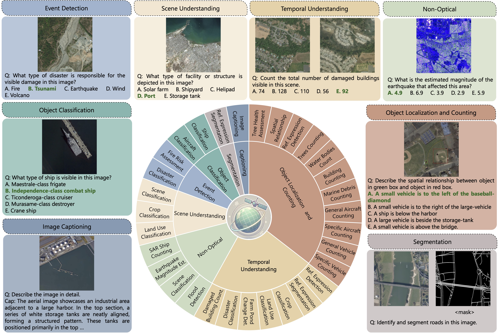
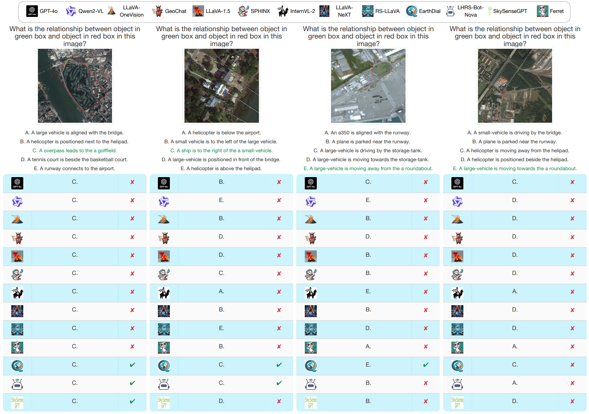

# GEOBench-VLM: Benchmarking Vision-Language Models for Geospatial Tasks

<p align="center">
    
</p>

#### [Muhammad Sohail Danish](https://www.linkedin.com/in/muhammad-sohail-danish/)\*, [Muhammad Akhtar Munir](https://akhtarvision.github.io/)\*, [Syed Roshaan Ali Shah](https://www.linkedin.com/in/syed-roshaan-ali-shah-b797b44a/), [Kartik Kuckreja](https://www.linkedin.com/in/kartik-kuckreja-930531221/), [Fahad Shahbaz Khan](https://sites.google.com/view/fahadkhans/home), [Paolo Fraccaro](https://research.ibm.com/people/paolo-fraccaro) , [Alexandre Lacoste](https://www.servicenow.com/research/author/alexandre-lacoste.html)   and [Salman Khan](https://salman-h-khan.github.io/)
\* Equally contributing first authors

#### **Mohamed bin Zayed University of AI, University College London, Linköping University, IBM Research Europe, UK, ServiceNow Research, Australian National University**

[](https://arxiv.org/abs/2411.19325)
[](http://the-ai-alliance.github.io/GEO-Bench-VLM)
[](https://huggingface.co/datasets/aialliance/GEOBench-VLM)


Official GitHub repository for  `GEOBench-VLM: Benchmarking Vision-Language Models for Geospatial Tasks`.
---

## 📢 Latest Updates
- **Jun-30-25**: Code is released.
- **Apr-04-25**: We have evaluated recent geospatial Vision-Language Models (VLMs). 
- **Dec-02-24**: We release the benchmark dataset [huggingface link](https://huggingface.co/datasets/aialliance/GEOBench-VLM). 
- **Dec-02-24**: Arxiv Preprint is released [arxiv link](https://arxiv.org/abs/2411.19325). 🔥🔥
---

## 🛠️ Leaderboard Coming Soon!

The leaderboard will be released shortly. Follow this repository for updates!

---

## 💡 Overview
<p align="center">
   </a>
</p>
<p align="justify"> <b> Figure</b>: GEOBench-VLM comprehensively covers 31 fine-grained tasks categorized into 8 broad categories: scene and object classification, object detection, segmentation, captioning, event detection, non-optical and temporal understanding tasks.

**<p align="justify"> Abstract:** While numerous recent benchmarks focus on evaluating generic Vision-Language Models (VLMs), they do not effectively address the specific challenges of geospatial applications.
Generic VLM benchmarks are not designed to handle the complexities of geospatial data, an essential component for applications such as environmental monitoring, urban planning, and disaster management.
Key challenges in the geospatial domain include temporal change detection, large-scale object counting, tiny object detection, and understanding relationships between entities in remote sensing imagery.
To bridge this gap, we present GEOBench-VLM, a comprehensive benchmark specifically designed to evaluate VLMs on geospatial tasks, including scene understanding, object counting, localization, fine-grained categorization, segmentation, and temporal analysis. 
Our benchmark features over 10,000 manually verified instructions and spanning diverse visual conditions, object types, and scales.
We evaluate several state-of-the-art VLMs to assess performance on geospatial-specific challenges. 
The results indicate that although existing VLMs demonstrate potential, they face challenges when dealing with geospatial-specific tasks, highlighting the room for further improvements.  
Notably, the best-performing LLaVa-OneVision achieves only 41.7\% accuracy on MCQs, slightly more than GPT-4o, which is approximately
double the random guess performance. </p>

## 🏆 Contributions

- **GEOBench-VLM Benchmark.**  We introduce GEOBench-VLM, a benchmark suite designed specifically for evaluating VLMs on geospatial tasks, addressing geospatial data challenges. It covers **8** broad categories and **31** sub-tasks with over **10,000** manually verified instructions.
- **Evaluation of VLMs.** We provide a detailed evaluation of **13** state-of-the-art VLMs, including generic (open and closed-source) and geospatial-specific VLMs, highlighting their capabilities and limitations in geospatial analysis.
- **Analysis of Geospatial Task Performance.** We analyze performance across a range of tasks, including scene classification, counting, change detection, relationship prediction, referring expression detection, segmentation, image captioning, disaster detection, and temporal analysis, among others, providing key insights that can help in improving VLMs for geospatial applications.
<hr />

## 🗂️ Benchmarks Comparison

<p align="center">
   </a>
</p>


<p align="justify"> <b> <span style="color: blue;">Table</span></b>: Overview of Generic and Geospatial-specific Datasets & Benchmarks, detailing modalities (O=Optical, PAN=Panchromatic, MS=Multi-spectral, IR=Infrared, SAR=Synthetic Aperture Radar, V=Video, MI=Multi-image, BT=Bi-Temporal, MT=Multi-temporal), data sources (DRSD=Diverse RS Datasets, OSM=OpenStreetMap, GE=Google Earth, answer types (MCQ=Multiple Choice, SC=Single Choice, FF=Free-Form, BBox=Bounding Box, Seg=Segmentation Mask), and annotation types (A=Automatic, M=Manual). </p>

<hr />

## 🔍 Dataset Annotation Pipeline
<p align="justify"> Our pipeline integrates diverse datasets, automated tools, and manual annotation. Tasks such as scene understanding, object classification, and non-optical analysis are based on classification datasets, while GPT-4o generates unique MCQs with five options: one correct answer, one semantically similar ``closest" option, and three plausible alternatives. Spatial relationship tasks rely on manually annotated object pair relationships, ensuring consistency through cross-verification. Caption generation leverages GPT-4o, combining image, object details, and spatial interactions with manual refinement for high precision.</p>
<p align="center">
   </a>
</p>


<hr />

## 📊 Results

Performance summary of VLMs. LLaVA-OneVision achieves the average accuracy (**41.7\%**), slightly outperforming GPT-4o, which is relatively better in building counting, and general aircraft counting. EarthDial demonstrates strong results in scene classification. The overall results highlight VLMs' varying strengths across geospatial tasks, with even the best models achieving accuracy only slightly above double the random guess
<p align="center">
   </a>
</p>


### Temporal Understanding Results

VLM performance on temporal geospatial tasks. Evaluation spans crop type classification, disaster type classification, farm pond change detection (CD), land use classification, and damaged building counting. 
EarthDial performs best in land use classification, while GPT-4o achieves better performance in disaster classification and damaged building counting. Qwen2-VL stands second in disaster classification.

<div align="center">

| **Model**            | **Crop Type Classification** | **Disaster Type Classification** | **Farm Pond Change Detection** | **Land Use Classification** | **Damaged Building Count** |
|---------------------|:---------------------------:|:--------------------------------:|:------------------------------:|:---------------------------:|:---------------------------:|
| EarthDial           | **0.2182**                  | 0.5727                          | **0.2105**                     | **0.6623**                  | 0.4362                      |
| GPT-4o              | 0.1818                      | **0.6300**                      | 0.1711                         | 0.6525                      | **0.5667**                  |
| LLaVA-OneVision     | 0.1455                      | 0.4537                          | 0.1842                         | 0.5869                      | 0.4810                      |
| Qwen2-VL            | 0.1091                      | 0.5991                          | 0.1974                         | 0.5967                      | 0.5000                      |

</div>

### Reffering Expression Detection
Referring expression detection. We report Precision on 0.5 IoU and 0.25 IoU
<div align="center">

| **Model**        | **Precision@0.5 IoU** | **Precision@0.25 IoU** |
|:----------------:|:---------------------:|:----------------------:|
| **Sphinx**       | **0.3408**            | **0.5289**             |
| EarthDial        | 0.2429                | 0.4139                 |
| GeoChat          | 0.1151                | 0.2100                 |
| Ferret           | 0.0943                | 0.2003                 |
| Qwen2-VL         | 0.1518                | 0.2524                 |
| GPT-4o           | 0.0087                | 0.0386                 |
| LHRS-Nova        | 0.0930                | 0.2423                 |
| SkySenseGPT      | 0.1082                | 0.3224                 |


</div>


<hr />

## 🤖 Qualitative Results

> <p align="justify"> <b> <span style="color: blue;">Scene Understanding</span></b>: This illustrates model performance on geospatial scene understanding tasks, highlighting successes in clear contexts and challenges in ambiguous scenes. The results emphasize the importance of contextual reasoning and addressing overlapping visual cues for accurate classification.
<p align="center">
  
</p>

> <p align="justify"> <b> <span style="color: blue;">Counting</span></b>: The figure showcases model performance on counting tasks, where Qwen 2-VL, GPT-4o and LLaVA-One have better performance in identifying objects. Other models, such as Ferret, struggled with overestimation, highlighting challenges in object differentiation and spatial reasoning.

<p align="center">
  
</p>

> <p align="justify"> <b> <span style="color: blue;">Object Classification</span></b>: The figure highlights model performance on object classification, showing success with familiar objects like the "atago-class destroyer" and "small civil transport/utility" aircraft. However, models struggled with rarer objects like the ``murasame-class destroyer" and ``garibaldi aircraft carrier" indicating a need for improvement on less common classes and fine-grained recognition.

<p align="center">
  
</p>

> <p align="justify"> <b> <span style="color: blue;">Event Detection</span></b>: Model performance on disaster assessment tasks, with success in scenarios like 'fire' and 'flooding' but challenges in ambiguous cases like 'tsunami' and 'seismic activity'. Misclassifications highlight limitations in contextual reasoning and insufficient exposure on overlapping disaster features.

<p align="center">
  
</p>

> <p align="justify"> <b> <span style="color: blue;">Spatial Relations</span></b>: The figure demonstrates model performance on spatial relationship tasks, with success in close-object scenarios and struggles in cluttered environments with distant objects.

<p align="center">
  
</p>


<hr />

## 📜 Citation
If you find our work and this repository useful, please consider giving our repo a star and citing our paper as follows:
```bibtex
@article{danish2024geobenchvlm,
      title={GEOBench-VLM: Benchmarking Vision-Language Models for Geospatial Tasks}, 
      author={Muhammad Sohail Danish and Muhammad Akhtar Munir and Syed Roshaan Ali Shah and Kartik Kuckreja and Fahad Shahbaz Khan and Paolo Fraccaro and Alexandre Lacoste and Salman Khan},
      year={2024},
      eprint={2411.19325},
      archivePrefix={arXiv},
      primaryClass={cs.CV},
      url={https://arxiv.org/abs/2411.19325}, 
}
```


## 📨 Contact
If you have any questions, please create an issue on this repository or contact at muhammad.sohail@mbzuai.ac.ae.

---
[](https://mbzuai.ac.ae)
[](https://www.ival-mbzuai.com)
[](https://research.ibm.com/labs/uk)
[](https://www.servicenow.com/)
[](https://thealliance.ai/)
